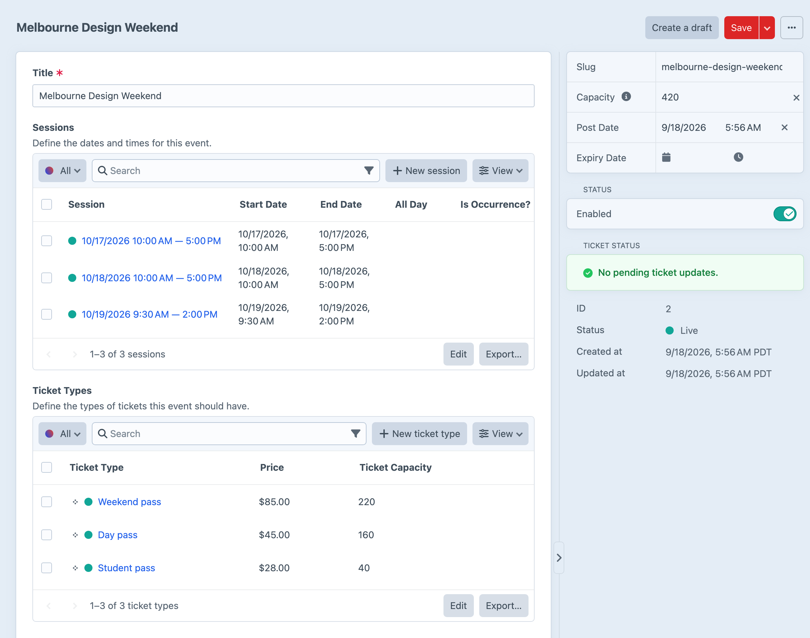
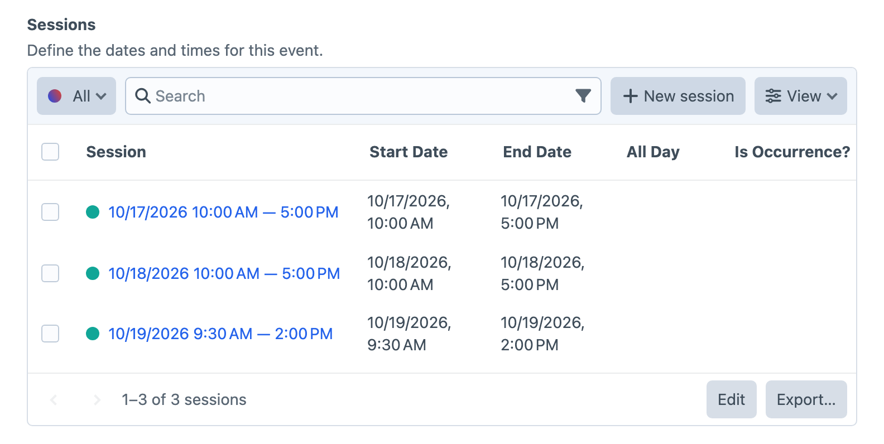
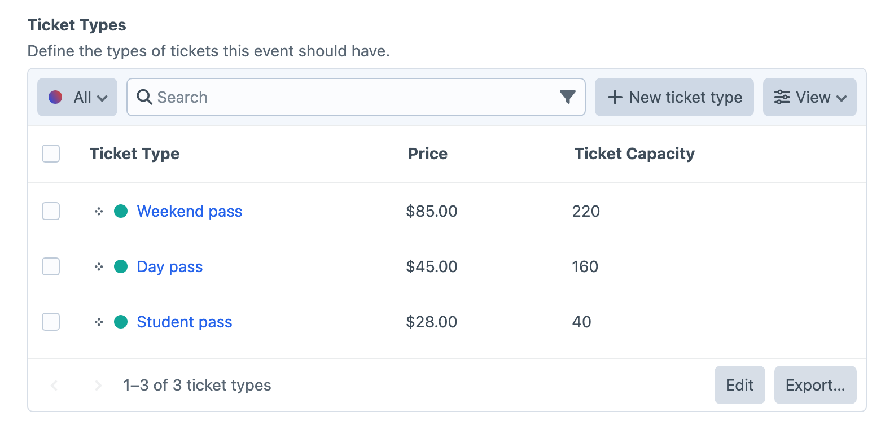

<!-- feature-intro -->
Full-featured event management and ticketing for Craft Commerce. Model the event you actually run, sell the right tickets, manage capacity and keep the customer journey connected from listing to venue door.
<!-- feature-intro-end -->

<!-- feature-section media-size="large" -->
## Sell tickets to events

Let customers purchase event tickets directly on the site with the flexibility of Craft and Craft Commerce. Events remain Craft elements, bringing familiar queries, permissions, custom fields and authoring patterns with them.

<!-- feature-section-end -->

<!-- feature-grid -->
- :icon[calendar-event] **Event types** Group events with their own fields, templates and URLs.
- :icon[forms] **Custom fields for days** Store the additional information each event and ticket needs.
- :icon[calendar-share] **ICS sharing** Offer downloads or subscriptions for an event, session, event type or custom event query.
- :icon[file-import] **Feed Me** Bring event content into Craft through established [Feed Me](https://plugins.craftcms.com/feed-me) workflows.
<!-- feature-grid-end -->

<!-- feature-section media-size="large" media-shadow="false" -->
## Flexible sessions

An event can happen once, run all day, span several dates or repeat on a daily, weekly or monthly schedule. Each session carries its own dates and optional capacity, so separate performances, workshop times or conference days can live under one event without becoming unrelated content.

When a recurring schedule changes, update one occurrence, the whole series, this and future sessions, or a selected range instead of rebuilding the calendar by hand.

<!-- feature-section-end -->

<!-- feature-section media-size="large" media-shadow="false" -->
## Ticket types and capacity

Create reusable ticket types, attach the fields each ticket needs, and sell them through Craft Commerce Lite or Pro. Capacity can be managed for the whole event or individual ticket types so availability reflects the limits that matter.

<!-- feature-section-end -->

<!-- feature-section -->
## Keep availability accurate

Purchased tickets reserve capacity while they are active. Cancel or restore a reservation from Craft, and optionally respond to order status changes or refunds so returned places become available without correcting totals by hand.
<!-- feature-section-end -->

<!-- feature-section media-size="medium" media-shadow="false" -->
## PDF tickets with QR codes

Generate PDF tickets from your Twig template and include a unique QR code for venue scanning. A successful scan authenticates and checks in the ticket, helping staff identify repeats rather than relying on a static printable code.

<!-- feature-section-end -->
